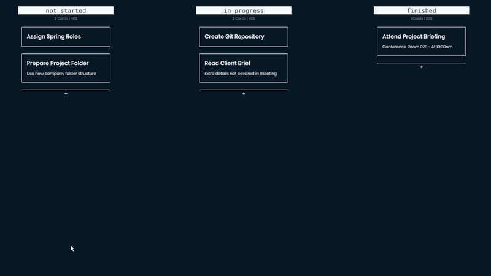

# Canban Demo in React

## Overview

This project is a simple Canban board demo built using React. It allows users to create, manage, and visualize tasks in a flexible and visual way. It offers two main branches, each with different functionalities:

- without-php-and-mysql Branch: This branch contains a basic implementation with example tasks hardcoded into the application. It's ideal for quick demonstrations and understanding the core Canban functionality.
- Master Branch: This branch extends the functionality by connecting to a database using PHP, enabling the storage and retrieval of tasks persistently. This branch is suitable for building upon and integrating into a larger project. It does not provide a schematic for the database though, but its a fairly easy structure.

## Demo




## Getting Started

1. Clone the repository:
```sh
git clone https://github.com/lamprecht-dev/canban_demo
```

2. Navigate to the desired branch:
```sh
cd canban-demo
git checkout without-php-and-mysql  # For the hardcoded tasks branch
git checkout master                 # For the database-connected branch
```

3. Install dependencies:
```sh
npm install
```


4. Start the development server:
```sh
npm start
```

## Contributing

Feel free to contribute to the project by forking the repository and making pull requests. Please ensure that your code adheres to the project's coding style and guidelines.